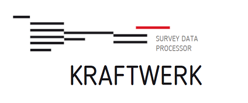

# Kraftwerk

:gb:

Kraftwerk is a Java Spring application designed to validate and process data from multimode surveys, to generate data tables ready-to-use for statistical purposes.
It heavily relies on metadata described using the [DDI](http://ddialliance.org) standard.
The automated processes can be enriched with specification written in [VTL](https://sdmx.org/?page_id=5096), thanks to [Trevas](https://github.com/InseeFr/Trevas) implementation.

Developer documentation can be found in the [wiki](https://github.com/InseeFr/Kraftwerk/wiki).

User documentation and functional tests are still in an [inhouse project](https://gitlab.insee.fr/sic/service-agregation-echange-de-donnees/kraftwerk).

## Requirements

* JDK 17 +
* Maven 3.6 +

Kraftwerk uses [Lombok](https://projectlombok.org/).

:fr:

Kraftwerk est une application Java Spring conçue pour valider et traiter des données provenant d'enquêtes multimodes, afin de générer des tableaux de données prêts à être utilisés à des fins statistiques.
Elle s'appuie fortement sur les métadonnées décrites à l'aide de la norme [DDI](http://ddialliance.org).
Les processus automatisés peuvent être enrichis par des spécifications écrites en [VTL](https://sdmx.org/?page_id=5096), grâce à l'implémentation de [Trevas](https://github.com/InseeFr/Trevas).

La documentation destinée aux développeurs est disponible sur le [wiki](https://github.com/InseeFr/Kraftwerk/wiki).

La documentation utilisateur et les tests fonctionnels sont encore dans un [projet interne](https://gitlab.insee.fr/sic/service-agregation-echange-de-donnees/kraftwerk).

## Configuration requise

* JDK 17 +
* Maven 3.6 +
  
Kraftwerk utilise [Lombok](https://projectlombok.org/).